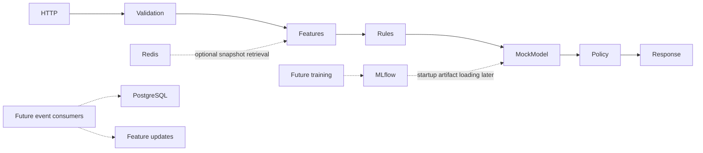

# FraudGuard

Production-oriented fraud detection, starting as a Python modular monolith.

**Phase 1: Architecture and Engineering Foundation. Current Fraud Model: MOCK.**
The model returns a constant `0.23`. No trained model, fraud accuracy claim, durable
transaction capture, authentication or real payment protection exists yet.

## Goals and architecture

Future engineering SLO: p50 <30 ms, p95 <100 ms, p99 <150 ms **server-side** scoring
latency in the documented local benchmark environment. These are targets, not results.



Routes contain transport concerns only. Domain entities and protocols use the Python
standard library. `ScoringService` coordinates serving. Model loading occurs once per
worker lifespan. Heavy models, analytics, training, registry calls, database writes and
broker acknowledgements stay outside scoring requests.
See [system design](docs/architecture/system-design.md) and [ADRs](docs/adr/).

## Quick start

Requirements: Python 3.12 or 3.13 and uv; or Docker Engine with Compose. For the full
stack reserve approximately 4 CPUs, 8 GB RAM and 10 GB disk. Ports bind to localhost.

```sh
cp .env.example .env
# Replace the two placeholder local passwords in .env.
docker compose up --build -d
docker compose ps
curl http://localhost:8000/health
curl http://localhost:8000/ready
curl -X POST http://localhost:8000/api/v1/transactions/score \
  -H 'Content-Type: application/json' --data-binary @scripts/sample-transaction.json
curl http://localhost:8000/metrics
```

On PowerShell use `Copy-Item .env.example .env` and `curl.exe` (or the smoke script
below). Configure `POSTGRES_PASSWORD` and `GRAFANA_ADMIN_PASSWORD` before Compose;
there are no committed usable passwords. Compose fails early if they are unset.
The migration service applies Alembic before exiting; it is intentionally not an API
dependency. Local API mode works without any infrastructure.

| Service | Address | Purpose |
|---|---|---|
| API | http://localhost:8000/docs | Mock scoring and OpenAPI |
| PostgreSQL | localhost:5432 | Future system of record; migrated tables |
| Redis | localhost:6379 | Optional example online snapshots |
| Redpanda | localhost:19092 | Future Kafka-compatible event transport |
| MLflow | http://localhost:5000 | Tracking/registry, SQLite metadata + artifact volume |
| Prometheus | http://localhost:9090 | API metric scraping |
| Grafana | http://localhost:3000 | Provisioned datasource and foundation dashboard |

Grafana user is `admin`, password from `.env`. MLflow/Redis/Redpanda have local-only
access, not production access controls. Do not expose this stack publicly.

## Local development

```sh
uv sync --locked
uv run python -m fraudguard
# In another terminal:
uv run python scripts/smoke.py
```

`APP_HOST`, `APP_PORT`, logging, CORS JSON array, serving mode and thresholds are
validated via Pydantic Settings. Local mock mode is the default. `APP_ENV=production`
is rejected in Phase 1 to prevent accidental use of mock protection. Never commit `.env`.
Local PostgreSQL and Redis defaults use `127.0.0.1` because Compose binds those ports
to IPv4 loopback; service containers override the hostnames on their internal network.
`uv.lock` pins transitive dependencies and hashes. Update deliberately with `uv lock
--upgrade`, then refresh both container exports and run checks. CI uses `--locked` and verifies
these exports against the committed lock:

```sh
uv export --locked --no-dev --no-emit-project --no-header -o requirements.lock
uv export --locked --only-group build --no-header -o requirements-build.lock
```

Make shortcuts are optional; these work on Windows too:

| Make | Equivalent |
|---|---|
| `make install` | `uv sync --locked` |
| `make dev` | `uv run python -m fraudguard` |
| `make test` / `make test-unit` | `uv run pytest` / `uv run pytest tests/unit` |
| `make test-integration` | `uv run pytest -m integration tests/integration` |
| `make lint` | `uv run ruff check .` |
| `make format` | `uv run ruff format .` |
| `make typecheck` | `uv run mypy` |
| `make up` / `make down` | `docker compose up --build -d` / `docker compose down` |
| `make logs` | `docker compose logs -f api` |
| `make benchmark` | `k6 run tests/performance/scoring.js` |

## Testing and migrations

Normal `uv run pytest` excludes external integration tests; API tests run in process.
For actual services, start `docker compose up -d postgres redis`, set `.env` credentials,
run `uv run alembic upgrade head`, then explicitly run the integration command above.
Tests verify connectivity, a Redis snapshot round trip and migrated table/constraint
behavior inside rolled-back database transactions. No destructive database reset.

```sh
uv run ruff format --check .
uv run ruff check .
uv run mypy
uv run pytest
uv run alembic upgrade head --sql
```

Alembic credentials come from Settings via a SQLAlchemy URL object, not string-concatenated
DSNs. Migrations are executable, reversible and independent of request serving.

## Redis example

Default `FEATURE_BACKEND=mock` needs no Redis. To exercise the real adapter:

```sh
uv run python scripts/seed_features.py
# Set FEATURE_BACKEND=redis in .env; restart API (Compose: up -d --force-recreate api).
uv run python scripts/smoke.py
```

The sample stores `example-v1` under the sample user for 300 seconds. Expired, missing,
malformed or future snapshots return 503. This is not a final feature definition or
point-in-time-correct historical store. Seed again when expired. Readiness checks Redis
connectivity when selected, not availability of every user's snapshot.

## Benchmarking

Install k6 separately and follow [benchmark protocol](tests/performance/README.md).
`k6 run tests/performance/scoring.js` reports p50/p95/p99, throughput and errors; it
also saves `benchmark-results.json`. Client latency includes network time. Prometheus
HTTP timing covers server request handling; response `latency_ms` covers only the
application service. None establishes final model performance.

## Repository structure

- `src/fraudguard/`: API, domain, configuration, features, rules, model, policy,
  application service, persistence contracts, events and monitoring.
- `tests/{unit,contract,integration,performance}/`: isolated, HTTP/schema, real-service,
  and load verification.
- `infrastructure/`: Alembic, container support, Prometheus and Grafana provisioning.
- `docs/architecture/`, `docs/adr/`, `docs/diagrams/`: design and decisions.
- `training/` under `src`, `notebooks/`, `data/`, `artifacts/`, `frontend/`: documented
  future boundaries; no invented training, data or UI implementation.
- `.github/workflows/ci.yml`: quality checks, service integration tests, image build and smoke.

## Phase 2 data foundation

FraudGuard now supports a reproducible adapter for the public, **simulated** Fraud
Detection Handbook data and a separate seeded synthetic operational simulator. Neither
is real banking data. The historical canonical schema deliberately excludes device,
location, channel, and currency fields absent from the handbook source; the operational
simulator maps its synthetic fields to the unchanged API request schema. See the
[data design](docs/data/data-design.md) for provenance, event-time, label, validation,
split, and leakage rules.

No fraud model has been trained. Generated source, Parquet, manifests, and simulator
exports remain out of Git. CI tests compact fixtures and deterministic simulation only;
it does not download the public source.

## Current limitations

No model quality evaluation, real features, durable event publication, scoring persistence,
idempotency guarantees, analyst feedback endpoint, authentication, TLS or deployment.
Country/currency validation checks code format, not an authoritative code list. Amounts
allow four fractional digits; currency-specific scale validation is future work. Timestamp
is timezone-aware but historic/future transaction acceptance policy is not yet defined.
`MONITOR` and `CHALLENGE` are reserved; only APPROVE/REVIEW/BLOCK are emitted.
The sample rule only adds a reason code. Compose is a single-machine simulation.

See [verification report](docs/verification.md) for checks actually executed in this workspace.

## Roadmap

Phase 3: feature engineering and the first real fraud model using Phase 2's temporal,
provenance, and leakage contracts. Add reproducible evaluation, MLflow tracking, a
feature/model contract, and quality gates. Benchmark the real predictor before extending
serving. Later phases may
add reliable event ingestion, online features, feedback, drift monitoring, streaming,
advanced intelligence, public UI and authenticated deployment. No scheduler or cloud
platform is selected now.
